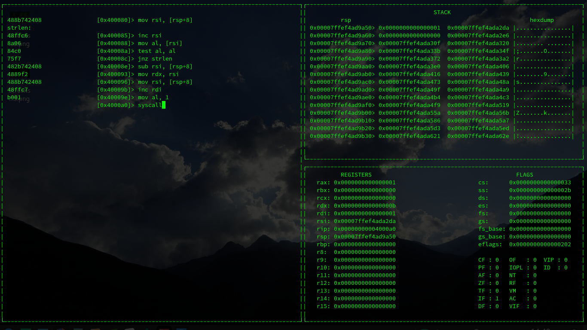

# Lasm



Requires nasm and keystone assembler library

To place a label (save an address to jmp to), type a string with ':' at the end 

```
                          [0x400080] label:
```
```
label:
4831c0                    [0x400080]> xor rax, rax
4885c0                    [0x400083]> test rax, rax
74f8                      [0x400086]> jz label
                          [0x400080]>
```

